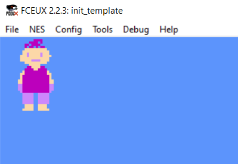

# NES Development

For as long as I've been playing video games, I've always wondered how they were created. Especially games for older consoles like the original Nintendo Entertainment System, as this development was taking place long before pre-made game engines and frameworks like Unity.

My curiosity has culminated in learning how to code for the NES to write programs/games.

Each folder in this project will outline small steps with source code that will be highly commented to hopefully shine some light on how thigs are working, for those others that are curious.

This may eventually end up with the creation of a game, but for the early projects, I will just be focusing on initializing the console and getting things to output to the screen. I will then move to controller inputs and eventually sound.

See the .asm files for the raw assembly source code of each ROM. The NES uses a MOS 6502 clone processor (minus decimal mode). For those curious as to how to write code, check out some video tutorials and read about the 6502 processor. The same processor was also used in the Commodore 64 and Apple II home computers.

My first project (and my first success!) was creating a sprite representation of myself, retrojack, and outputting it to the screen.

The ROM of "HelloJack" running - and outputting my sprite to the screen - small steps!:

To compile the source and create a ROM, use the "sample_make.bat" file from each project folder after cloning. Then choose your emulator of choice and load it as you would any NES game.

Tooling:
https://sourceforge.net/projects/cc65/files/cc65-snapshot-win32.zip - CC65 compiler
https://tasvideos.github.io/fceux/web/download.html - Emulator FCEUX with useful debug tools
https://www.romhacking.net/utilities/119/ - YY-CHR tile (graphics) viewer/editor